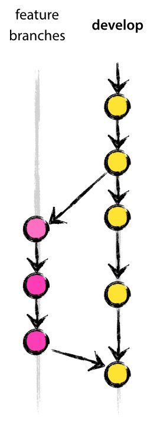

# The Git Flow Workflow
The Git flow workflow based on my practical experience.

## Application
<details>
  <summary>Git Flow</summary>

  
</details>

This Git flow workflow is applied to the class of software developed to support multiple versions in the wild.

## Main Branches
<details>
  <summary>Main Branches</summary>

  
</details>

### Master
- Infinite lifetime.
- Each commit is a new production release by definition.
- Reflecting the production-ready state.

### Develop
- Infinite lifetime.
- Merged back into `master` and tagged with a release number when ready to be released.
- Reflecting the state with the latest delivered development changes for the next release.

## Supporting Branches
### Feature
<details>
  <summary>Feature Branches</summary>

  
</details>

- Limited lifetime, existing as long as the feature is in development.
- Branched off from `develop` and merged back into `develop`.
- Branch naming convention: `feature-*`.
- Developing new features for the upcoming or a distant future release.

**Creating a feature branch**
```
$ git checkout -b feature-my-feature develop
```

**Incorporating a finished feature on develop**
```
$ git checkout develop
$ git merge --no-ff feature-my-feature
$ git branch -d feature-my-feature
$ git push origin develop
```

**NOTES**

The `--no-ff` flag:
<details>
  <summary>Git Merge Comparison</summary>

  
</details>

- Causing the merge to always create a new commit object, even if the merge could be performed with a fast-forward.
- Avoiding losing information about the historical existence of a feature branch.
- Grouping together all commits that together added the feature.

### Release
- Limited lifetime, existing until the release may be rolled out definitely.
- Branched off from `develop` and merged back into `develop` and `master`.
- Branch naming convention: `release-*`.
- At the start, assigning the upcoming release a version number.
- Supporting the preparation of a new production release (fixing minor bugs, preparing meta-data, etc.).
- Clearing `develop` to receive features for the next big release.

**Creating a release branch**
```
$ git checkout -b release-v1.2.0 develop
$ ./bump-version.sh v1.2.0
$ git commit -a -m "Bumped version number to v1.2.0"
```

**NOTES**
- `bump-version.sh` is a fictional shell script that changes some files in the working copy to reflect the new version.
- Adding large new features here is strictly prohibited.

**Finishing a release branch**
```
$ git checkout master
$ git merge --no-ff release-v1.2.0
$ git tag -a v1.2.0
```
```
$ git checkout develop
$ git merge --no-ff release-v1.2.0
```
```
$ git branch -d release-v1.2.0
```

### Hotfix
<details>
  <summary>Hotfix Branches</summary>

  
</details>

- Limited lifetime, existing until definitely resolving a critical bug in a production version.
- Branched off from `master` and merged back into `develop` and `master`.
- Branch naming convention: `hotfix-*`.
- Immediately resolving a critical bug in a production version.

**Creating the hotfix branch**
```
$ git checkout -b hotfix-v1.2.1 master
$ ./bump-version.sh v1.2.1
$ git commit -a -m "Bumped version number to v1.2.1"
```
```
$ git commit -m "Fixed severe production problem"
```

**Finishing a hotfix branch**
```
$ git checkout master
$ git merge --no-ff hotfix-v1.2.1
$ git tag -a v1.2.1
```
```
$ git checkout develop
$ git merge --no-ff hotfix-v1.2.1
```
```
$ git branch -d hotfix-v1.2.1
```

**NOTES**
- When `release-*` currently exists, the hotfix changes need to be merged into `release-*`, instead of `develop`.

## References
- [A successful Git branching model](https://nvie.com/posts/a-successful-git-branching-model)
